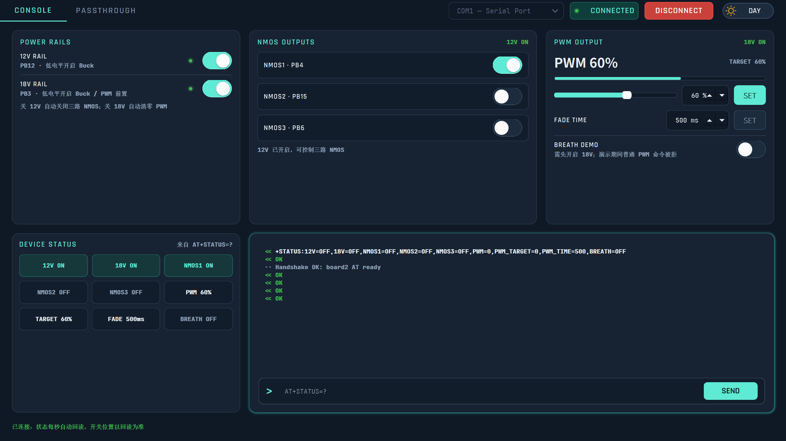

# stem-hub-board2 上位机

STM32 `stem-hub-board2` 固件的 Qt Python 上位机（PySide6）。界面风格移植自
[stem-hub-host](../stem-hub-host)。完整板2协议见本仓
[docs/board2-at-contract.md](docs/board2-at-contract.md) 和固件仓
[board2-at-uart-pwm.md](../stem-hub-board2/docs/board2-at-uart-pwm.md)。



## 功能

- **控制台 (Tab 1)**：12V / 18V 电源轨开关，NMOS1/2/3 开关（12V 联锁），
  PWM 0–100% 占空比 + 渐变时间设置 + 当前/目标双显示（18V 联锁），呼吸灯演示，
  `AT+STATUS=?` 回读芯片墙，以及可发任意命令的 AT 终端
- **UART 透传 (Tab 2)**：`AT+TRANS=1|2|1&2` 三种目标选择，`+++` 退出，
  文本/HEX 发送，`+UART2RX` / `+UART3RX` 事件接收与 HEX 视图，TX/RX 字节计数
- **联锁与固件一致**：12V 关 → NMOS 禁用；18V 关 → PWM 只能为 0；
  关 12V 自动关三路 NMOS；关 18V 自动清 PWM；呼吸灯期间普通 PWM 被拒
- **Dark / Light 双主题**，设置持久化；Windows 原生标题栏同色
- **`--fake` 模拟固件**：无硬件即可完整联调全部功能（含联锁、渐变、透传回环）

## 快速开始

环境搭建完整步骤见 [env/README.md](env/README.md)。一次性概览：

```powershell
# 1. 用本机 miniconda 创建开发环境 (一次性, 详细见 env/README.md)
C:\ProgramData\miniconda3\Scripts\conda.exe create -n stem-hub-board2-host python=3.11 -y
C:\Users\44575\.conda\envs\stem-hub-board2-host\python.exe -m pip install `
    -i https://pypi.tuna.tsinghua.edu.cn/simple -r requirements.txt

# 2. 跑程序
C:\Users\44575\.conda\envs\stem-hub-board2-host\python.exe -m stem_hub_board2_host.main
```

串口固定 9600 8N1。握手使用 `AT+STATUS=?`，5 秒内完整回包即连接成功。

## 无硬件联调

没有串口或下位机时，使用内置 fake firmware 启动完整、可操作的界面：

```powershell
# 从保留的发布环境启动源码
& 'env\release\Scripts\python.exe' -m stem_hub_board2_host.main --fake

# 打包后启动
& 'dist\stem-hub-board2-host.exe' --fake
```

fake 模式会自动创建并打开 `FAKE0`，模拟 AT 解析、联锁、PWM 渐变、
透明模式与下游设备回包（`+UARTxRX` 事件），适合直接观察 UI 与操作效果。

## 运行测试

```powershell
& 'C:\Users\44575\.conda\envs\stem-hub-board2-host\python.exe' -m pytest tests -q
```

覆盖：AT 协议解析、STATUS / UARTxRX / 错误行解析、握手流程、
12V/18V 联锁、透传进入/发送/`+++` 退出（基于 FakeSerialTransport + 假固件）。

## 项目结构

```
stem-hub-board2-host/
├── env/README.md                 # 环境搭建说明 (conda + release venv)
├── requirements.txt              # 开发依赖
├── requirements-release.txt      # 发布依赖 (固定版本)
├── stem-hub-board2-host.spec     # PyInstaller 打包配置
├── stem_hub_board2_host/         # 主包
│   ├── main.py                   # 入口 (--fake 支持)
│   ├── app.py / branding.py      # QApplication 装配 / 图标
│   ├── serial_worker.py          # 行切分 + 单发等回包 FIFO + 重同步
│   ├── transport.py              # 真串口 / 内存模拟 transport
│   ├── at_protocol.py            # 板2 AT 命令构造 + 响应解析
│   ├── controller.py             # 握手 / 命令编排 / 联锁 / 透传状态机
│   ├── models.py                 # StatusState / UartRxFrame / AtError
│   ├── fake_firmware.py          # 模拟固件 (--fake)
│   ├── resources/                # fonts / icons (与参考工程共用授权)
│   └── ui/
│       ├── main_window.py        # 主窗口 + 信号绑定 + 门禁
│       ├── theme.py / style.qss  # 设计令牌 + QSS (移植自 stem-hub-host)
│       ├── fonts.py / stylesheet.py / native_chrome.py
│       ├── tab1_console.py       # Tab1 控制台
│       ├── tab2_passthrough.py   # Tab2 透传
│       └── widgets/              # serial_bar / toggle_switch / cards ...
├── docs/
│   ├── board2-at-contract.md     # 上位机视角的板2 AT 契约
│   └── screenshot-*.png          # 运行截图
└── tests/                        # pytest
```

## 协议摘要

- UART1 = 9600 8N1；AT 命令必须全大写、**无空格**、`\r\n` 结尾
- 成功返回 `OK`；错误返回 `+ERROR:PARSE|RANGE|12V_DISABLED|18V_DISABLED|...`
- 查询：`AT+STATUS=?` → `+STATUS:12V=,18V=,NMOS1=,NMOS2=,NMOS3=,PWM=,PWM_TARGET=,PWM_TIME=,BREATH=` + `OK`
- 控制：`AT+12V` / `AT+18V` / `AT+NMOS1..3` / `AT+PWM` / `AT+PWM_TIME` / `AT+BREATH_TEST`
- 透传：`AT+TRANS=1|2|1&2` 返回 OK 后进入；发送前后各静默 ≥1ms 的 `+++` 退出；
  下游数据以 `+UART2RX:<HEX>` / `+UART3RX:<HEX>` 事件回传（单事件 ≤32 字节）
- `AT+UARTTX` 为兼容保留，AT 模式下固定返回 `+ERROR:UART_DISABLED`

完整约束见 [docs/board2-at-contract.md](docs/board2-at-contract.md)。

## 精简发布包

发布包必须在独立的 Python 3.11 虚拟环境中构建（从 conda 环境派生），
依赖固定在 `requirements-release.txt`。

```powershell
# 1. 从已验证的 conda 环境解释器创建隔离环境 (一次性)
& 'C:\Users\44575\.conda\envs\stem-hub-board2-host\python.exe' -m venv 'env\release'

# 2. 安装固定版本的 PyPI 依赖
& 'env\release\Scripts\python.exe' -m pip install --upgrade pip
& 'env\release\Scripts\python.exe' -m pip install `
    -i https://pypi.tuna.tsinghua.edu.cn/simple -r requirements-release.txt

# 3. 完整测试后执行干净构建
& 'env\release\Scripts\python.exe' -m pytest tests -q
& 'env\release\Scripts\python.exe' -m PyInstaller --clean --noconfirm stem-hub-board2-host.spec
```

构建完成后验收：用 `--fake` 启动 `dist\stem-hub-board2-host.exe`，
确认主窗口出现且握手成功；打包清单应包含 `style.qss`、四个字体文件和图标，
且不包含 `mkl*.dll` 或 `tbb*.dll`（本工程未引入 numpy，天然满足）。

## 视觉与代码来源说明

配色令牌（`theme.py`）、`style.qss`、串口栏、开关、AT 终端、透传面板、
字体与图标均移植自 `stem-hub-host`，按板2 功能做了裁剪与改名；
协议层、controller、fake firmware 按板2 固件协议重写。
字体授权见 `stem_hub_board2_host/resources/fonts/OFL.txt`。
